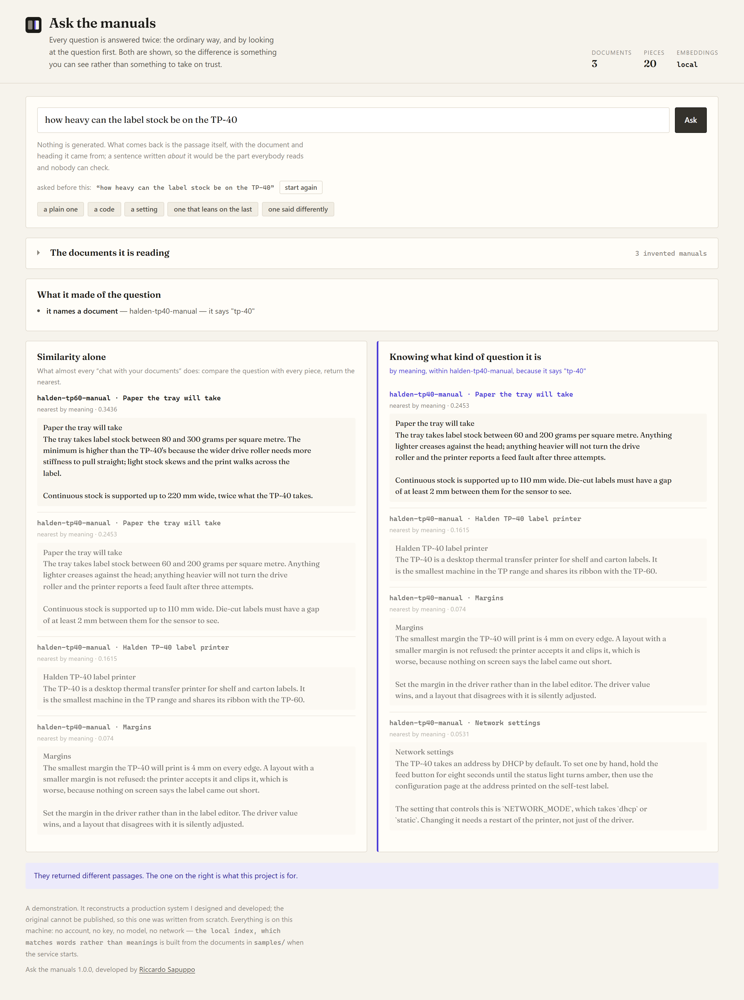
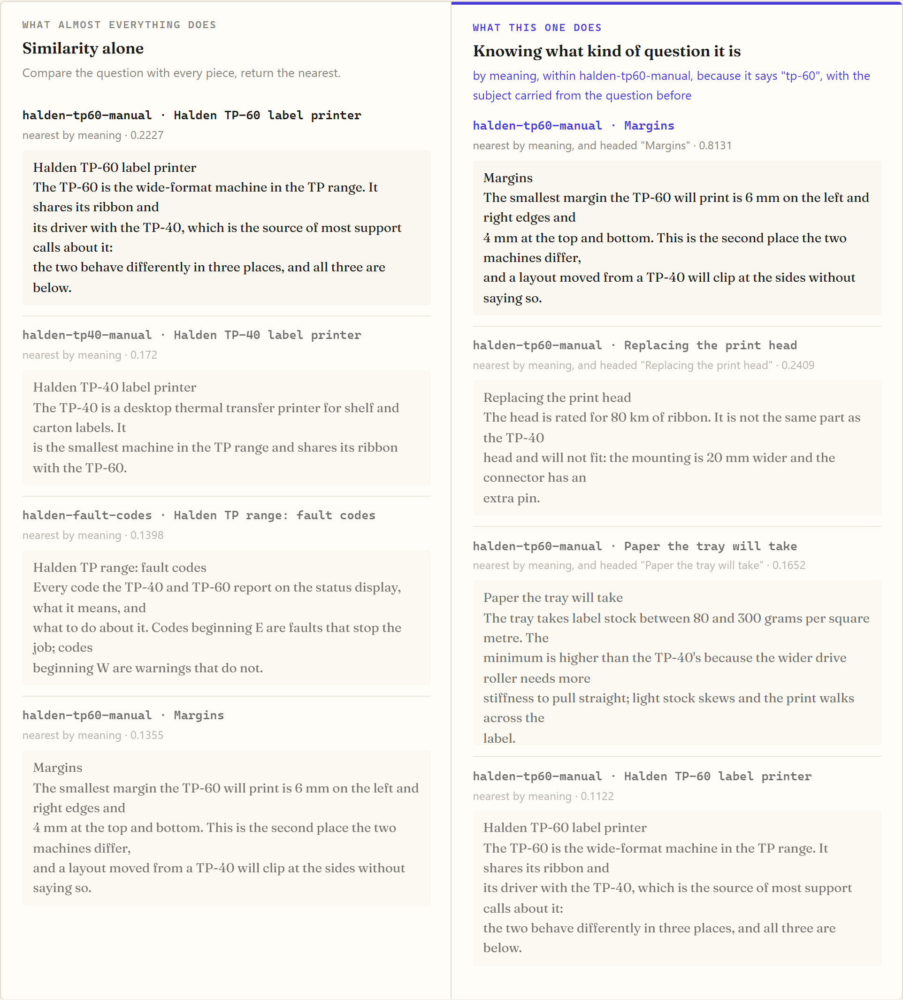
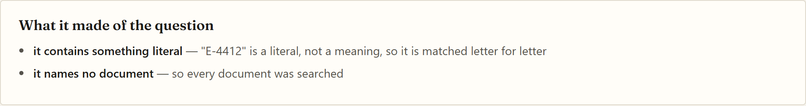

# Ask the manuals

A question-answering service over a set of documents, whose argument is a
narrow one:

> **A vector search is the wrong tool for a large share of what people actually
> ask a manual — and it fails at those questions confidently, with a citation.**

So before anything is retrieved, the question is looked at. What kind of
question is it? Does it stand on its own, or is it leaning on the one before?
Does it contain something that has to match letter for letter? Which of the
documents is it even about? Each of those is a branch, each branch exists
because plain similarity gets that class wrong, and **`npm run measure` reports
by how much**.

The original was built for a client and lives in a private repository. This is
an independent reimplementation, written from scratch with invented documents —
but the retrieval it argues for is traced from that code, which had learned all
of this the expensive way, in production, one class of complaint at a time.



---

## Before you start

**Node 24 or newer**, and nothing else at all. No account, no API key, no model,
no database, no container, no vector store. The index is built from the
documents in `samples/` when the service starts, which for a corpus this size
takes less time than the port takes to bind.

| to run | you need |
| --- | --- |
| the service, the console, `npm test`, `npm run measure` | Node ≥ 24 |
| `npm run measure` with real embeddings | `OPENAI_API_KEY`, and it is optional |
| `npm run check:screen`, `check:mark`, `screenshots` | **Microsoft Edge** — they drive the browser already on this machine rather than downloading one |

**Measured, not estimated:** `npm install` fetches **70 packages** and writes
**17.7 MB** into `node_modules`. Only **2.3 MB** of that is the service — one
dependency does not bring much with it — and the rest is the browser driver
those last three need, which `npm install --omit=dev` does not fetch. Nothing
reaches the network at runtime, ever: that is what the local index is for.

**To put the machine back:** delete `node_modules/` and the clone. Nothing is
installed globally, nothing is registered, no port is left listening.

## Run it

```bash
npm install
npm start        # the console on http://127.0.0.1:3700
```

Then ask it something. Every question is answered **twice** — the ordinary way
and by looking at the question first — and both are shown, so the difference is
something you can see rather than a claim to take on trust.

---

## Bring your own document

The three invented manuals answer the questions above, so nothing has to be
brought along to try this. But a retrieval system is only interesting on text
somebody actually cares about, so the console takes **`.md`, `.txt` and `.pdf`**
— dropped on it, or chosen — and indexes them beside the manuals.

A PDF is read for the text it already carries. That reader
([`src/text/pdf.js`](src/text/pdf.js)) is copied from a sibling project, where
the argument was that most PDFs already contain their text and recognising it
from the pixels instead is slower, costs money per page, and gives a worse
answer than the one that was already there. **A scan has no text to find**, and
is refused saying exactly that rather than indexed as an empty document.

**Nothing is written to disk.** What you add lives in memory and is gone when
the service stops. That is not a missing feature: an upload folder on a machine
somebody else is running is a place to put things that should not be there, and
this is a demonstration anybody can open.

### Adding a document rebuilds the whole index

Not the new document’s part of it. The whole thing, every time — and that is
the interesting consequence of how documents are found.

A document’s **names** are worked out against the whole corpus: an ordinary
word only becomes a name if it appears *nowhere in any other document*. That is
what makes "and the wide one?" answerable, since the TP-60 opens by calling
itself wide-format and nothing else in the folder uses the word.

So a fourth document can take a name away from the second. Add anything that
happens to mention wide-format and the TP-60 stops being findable that way —
correctly, because the word has stopped identifying it. An index that appended
the new document and left the others alone would keep a name that had quietly
stopped being unique, and answer "and the wide one?" with the wrong manual,
confidently.

Rebuilding costs a fraction of a second on a corpus this size. A real one needs
the incremental version of that argument, not a way around it — which is named
in [`src/index/corpus.js`](src/index/corpus.js) rather than left to be
discovered.

Seven of the checks in `npm run check:screen` are this path: a document that did
not exist when the service started is dropped in, asked about, found by a name
derived from its own words — and the three invented manuals still answer as they
did, which is the half that breaks if the rebuild is wrong.

## The measurement

```bash
npm run measure
```

Twelve questions with a known right answer, grouped by kind, each judged on
**the first result only** — because whatever is first is what gets read, quoted
and acted on, and "it was in the top five" is how retrieval is usually reported
and is not how it is used.

```
question           similarity alone   knowing the kind
ordinary                  2/3               3/3  ←
said differently          0/2               0/2
literal                   2/4               4/4  ←
leaning                   2/3               2/3
all of them               6/12              9/12
```

Per kind, never as one number, because the finding is not "this is better". The
baseline is wrong in **particular places**, and saying which is the whole
content of the claim.

### What each kind is

**ordinary** — phrased in the document's own words. A similarity search is good
at these, and a change that improved the others by breaking these would not be
an improvement. The measurement fails the run if any question plain similarity
got right is traded away.

**literal** — `E-4412`, `NETWORK_MODE`. A code has no semantic neighbours: it is
an arbitrary string, so its embedding is near other arbitrary strings, which is
to say near nothing. Asked "what does E-4412 mean", plain similarity returns the
passage most *about* fault codes in general. The right tool is a literal match,
and the branch that fires says so on screen.

**leaning** — "and the TP-60?", "is it the same part?". Not questions at all on
their own. Embed one and you get the centre of every short vague sentence in the
corpus, returned confidently and about the wrong thing.



The subject of the previous question is carried forward — but **the question in
front of you decides which document**, not the one before it. That is not a
detail: "and the TP-60?" carries the words of a TP-40 question forward, those
words contain "TP-40", and for a while the carried subject out-voted the named
one and the answer came back about the machine the person had just stopped
asking about. Which is the exact failure the carrying was added to prevent,
arriving from the other side.

**said differently** — the words in the question are not the words in the
document. **Both approaches score zero here, and that is the honest half of this
page.** The default index is lexical — it matches words, not meanings — so
"faded on one side" cannot reach "quality falls off at one edge". This is
exactly what a real embedding is for:

```bash
EMBEDDINGS=openai OPENAI_API_KEY=… npm run measure
```

and the table changes shape. The console and the report always say which
provider produced the numbers, because a table that did not would be a table
about nothing.

---

## What it made of the question



Every decision is shown, in the words of the thing that made it: which branch
fired, which document was chosen and on which word, and what the question was
rewritten to when it did not stand on its own.

That is not decoration. A retrieval system that answers without saying why is a
system whose wrong answers cannot be traced to anything — the only available
explanation is "the model", which is not an explanation and cannot be fixed. A
wrong answer here points at the branch that produced it.

**Nothing is generated.** What comes back is the passage itself with its
document and heading. A sentence written *about* the passage would be the part
everybody reads and the part nobody can check, and it would hide precisely what
this project is about.

---

## Which document is it about

This step was missing from the first version and the measurement found it within
a minute of existing.

The two printer manuals are written from the same template — "Paper the tray
will take", "Margins", "Replacing the print head" — so a question about the
TP-40 came back with the right section of the **TP-60**. That is the most
convincing wrong answer a manual can give: everything about it looks right,
including the heading.

No better embedding fixes it. The two passages *are* about the same thing; the
difference between them is a name, and **a name is matched, not measured**.

So each document's names are worked out from its own first lines, and there are
two kinds because they cannot follow the same rule:

- **part numbers**, kept whatever else mentions them — `tp-40` is also `tp40`,
  `tp 40` and `tp/40`, and the TP-60's manual talks about the TP-40 in its first
  paragraph, so a rule that dropped any name another document says would leave
  the TP-40 manual with no reliable name at all;
- **ordinary words**, but only those appearing **nowhere in any other
  document** — which is what makes "and the wide one?" answerable, since the
  TP-60 opens by calling itself wide-format and nothing else in the folder uses
  the word.

Four weaker versions of that second rule are recorded in the comments beside it,
each with the wrong answer it produced.

---

## What it still gets wrong

Named here rather than left to be discovered, and reported by `npm run measure`
every time it runs.

**Synonymy, with the local index.** Covered above: it is lexical, and this is
what an embedding is for.

**Comparative questions.** "Is it the same part?" after a question about the
TP-40 is answered from the TP-40's manual, and the passage that answers it is in
the TP-60's — the one that says *"It is not the same part as the TP-40 head"*. A
question comparing two things needs both documents, and this picks one. It is a
known miss, in the report, on purpose.

**A corpus of three documents.** Twenty pieces is enough to show the shape of
the problem and too small to prove a ranking. The numbers above are a
demonstration, not a benchmark result.

---

## What it is checked with

```bash
npm test              # 63  the cutting, the classifying, the naming, the vectors
npm run measure       #      the claim, against twelve questions with known answers
npm run check:screen  #  27  the console, driven with a browser
npm run check:mark    #  11  the icon, at the size it is actually seen
npm run check:serving #  22  nobody can be handed yesterday's page
```

Every one of those numbers is checked by the program it is a number about, at
the end of its own run. A count in a README is a claim about something sitting
right there and able to be asked; left unasked it stays true until the day it
quietly does not.

---

## How it is put together

```
src/text/normalise.js        one place that decides what "the same" means
src/index/chunks.js          cutting a document up, at headings and then by window
src/index/embed.js           something comparable: local by default, OpenAI optional
src/index/build.js           the index, held in memory on purpose
src/ask/what-kind-of-question.js   the argument: what sort of question is this
src/ask/which-document.js    which manual it is about, before looking inside any
src/ask/find.js              the two retrievals, side by side
src/measure/questions.js     the claim, as questions with known answers
src/http/api.js              the service and the console
```

One dependency, [express](https://expressjs.com). The index is held in memory
and that is a decision rather than a stage this has not reached: the corpus is
three manuals, and a database between the chunks and the search would be
machinery serving nothing while hiding the part worth reading. A real one needs
a store that survives a restart, an index that can be rebuilt document by
document rather than wholesale, and vectors that do not all have to fit in
memory at once — none of which changes a line of the retrieval above, which is
the point of it being in files of its own.

---


Developed by **Riccardo Sapuppo**.
